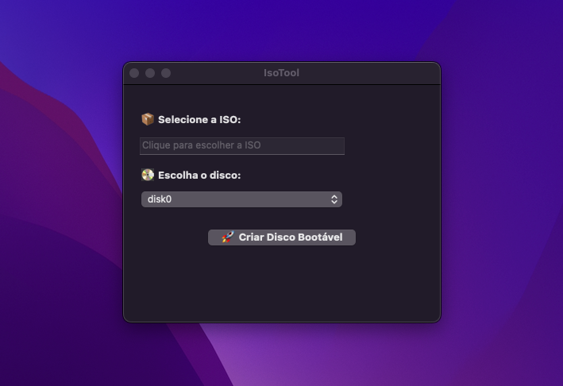

# 🛠️ IsoTool

**IsoTool** é uma aplicação minimalista e eficiente para macOS que permite gravar imagens `.iso` em unidades USB de forma bootável com apenas alguns cliques. Desenvolvido em Swift com Cocoa, sem uso de Xcode, oferece uma interface gráfica amigável, progresso visual em tempo real e integração nativa com ferramentas de sistema.

 <!-- Substitua com uma imagem real do app se quiser -->

---

## 🚀 Recursos

- Interface gráfica simples e objetiva (GUI nativa macOS)
- Suporte a seleção de arquivos `.iso`
- Detecção automática de discos disponíveis no sistema
- Barra de progresso com porcentagem de gravação
- Criação de pendrives bootáveis com o comando `dd`
- Ícone personalizado `.icns` para o app
- Totalmente offline (sem dependências externas)

---

## 🖥️ Requisitos

- macOS 10.12 ou superior
- Swift 5+
- Ferramentas nativas instaladas:
  - `diskutil`
  - `dd`

---

## 📦 Instalação

Clone o repositório:

```bash
git clone https://github.com/seu-usuario/IsoTool.git
cd IsoTool
